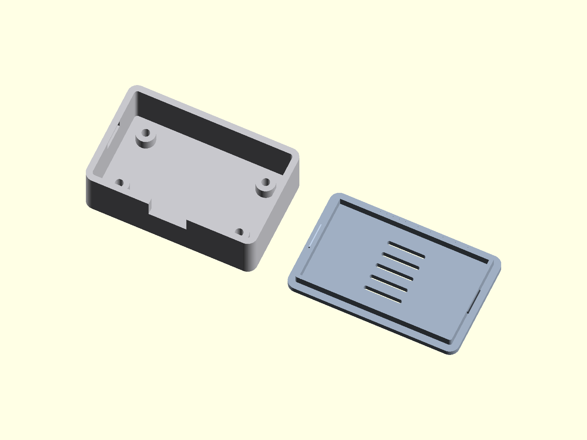

# Parametric Snap-Fit PCB Enclosure

A two-part 3D-printable PCB enclosure (base + snap-fit lid) written in pure native
OpenSCAD with no library dependencies. Every dimension is a named parameter, so the
enclosure resizes cleanly around any board — standoffs, snap tabs, vents and cable
cutout all follow.



## Parameters

| Parameter | Default | Unit | Meaning |
|---|---|---|---|
| `cavity` | `[50, 30, 15]` | mm | Inner cavity size L x W x H |
| `wall` | `2` | mm | Wall thickness (sides and floor) |
| `corner_r` | `3` | mm | Outside corner radius |
| `standoff_pts` | `[[6,6],[44,6],[6,24],[44,24]]` | mm | PCB standoff centers from inner cavity origin |
| `standoff_d` | `6` | mm | Standoff outer diameter |
| `standoff_h` | `4` | mm | Standoff height above cavity floor |
| `screw_d` | `2.5` | mm | Screw pilot hole diameter |
| `lid_clearance` | `0.2` | mm | Fit gap between lid lip and base cavity wall |
| `lid_th` | `2` | mm | Lid plate thickness |
| `lip_h` | `3` | mm | Lid lip height (depth it enters the base) |
| `lip_th` | `1.2` | mm | Lid lip wall thickness |
| `snap_tabs` | `true` | — | Add snap nubs on lip + pockets in base walls |
| `snap_tab_w` | `8` | mm | Snap nub ridge length |
| `snap_tab_h` | `3` | mm | Snap pocket height in base wall |
| `snap_nub` | `0.6` | mm | Snap nub protrusion (ridge radius) |
| `cable_cut` | `[12, 6]` | mm | Cable notch W x H through one long wall at the top edge |
| `vents` | `true` | — | Add vent slots in lid top |
| `vent_count` | `5` | — | Number of vent slots |
| `vent_slot` | `[12, 1.2]` | mm | Vent slot L x W |
| `vent_pitch` | `4` | mm | Spacing between vent slot centers |
| `assembly_gap` | `10` | mm | Gap between base and lid in `"both"` layout |
| `part` | `"both"` | — | Which part to build: `"both"`, `"base"`, `"lid"` |
| `col_base`, `col_lid` | grays | — | Render-only presentation colors (no effect on STL geometry) |

## Render views

- [render.png](render.png) — isometric portfolio view (base + lid)
- [render_top.png](render_top.png) — top view (standoff layout, vents)
- [render_side.png](render_side.png) — low side view (cable cutout, lid lip and nubs)
- [render_detail.png](render_detail.png) — close-up of standoff, snap pocket and lid nub

## Printing

- **Base** prints open-side-up, no supports needed.
- **Lid** is modeled print-flat (outer face on the bed, lip up), no supports needed.
- The lid nubs snap into pockets in the base walls; tune `lid_clearance` and
  `snap_nub` for your printer.

## Render / export

```powershell
# Portfolio render (both parts, high quality)
& "C:\Program Files\OpenSCAD\openscad.exe" -o render.png --imgsize=1600,1200 `
  --autocenter --viewall --projection=o --camera=0,0,0,28,0,25,500 `
  -D '$fn=96' enclosure.scad

# STL exports
& "C:\Program Files\OpenSCAD\openscad.exe" -o enclosure_base.stl -D '$fn=96' -D 'part="base"' enclosure.scad
& "C:\Program Files\OpenSCAD\openscad.exe" -o enclosure_lid.stl  -D '$fn=96' -D 'part="lid"'  enclosure.scad
```
