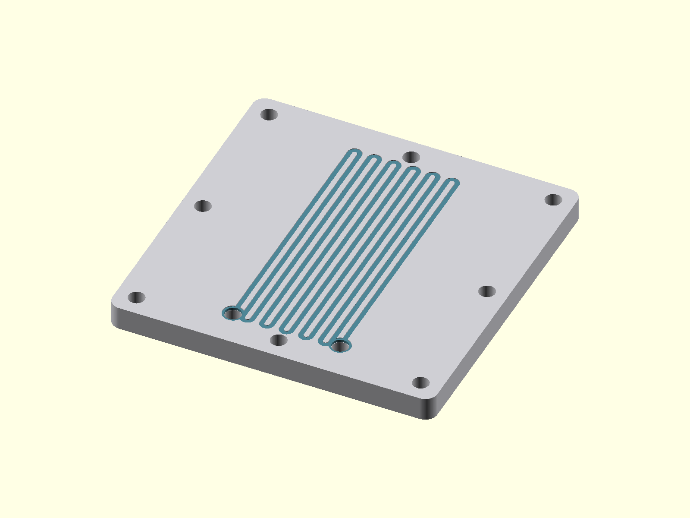

# Parametric Serpentine Flow-Field Plate

Generic parametric tool — not a proprietary design. A single-channel serpentine
flow-field plate of the kind used in fuel-cell and electrolyzer stacks, written as
CAD-as-code for electrochemical hardware concepts: the entire channel path
(straight passes, rounded 180° U-turns, port pads) is generated programmatically
from the parameters, never drawn by hand. Informed by hands-on electrochemical
hardware and PEM electrolyzer/fuel-cell testing experience.

Not copied from any company's hardware and not a production-ready
electrochemical design — a demonstration of parametric modeling for this class
of part.



## Parameters

| Parameter | Default | Unit | Meaning |
|---|---|---|---|
| `plate` | `[80, 80, 6]` | mm | Plate L x W x thickness |
| `chan_w` | `1.2` | mm | Channel width |
| `land_w` | `1.2` | mm | Rib/land width between adjacent passes |
| `chan_d` | `0.8` | mm | Channel depth (must be < plate thickness) |
| `passes` | `12` | — | Number of serpentine straight passes |
| `seal_land` | `6` | mm | Flat gasket/seal margin around the active area |
| `bend_r` | `chan_w` | mm | Baseline U-turn radius (clamped to pitch/2 with a warning if larger) |
| `port_d` | `4` | mm | Inlet/outlet port hole diameter |
| `bolt_d` | `4` | mm | Bolt hole diameter |
| `bolt_n` | `8` | — | Number of bolt holes (multiple of 4) |
| `bolt_margin` | `5` | mm | Bolt center inset from the outer edge |
| `corner_r` | `3` | mm | Plate outside corner radius |
| `show_section` | `false` | — | Cutaway at the port line (verification only) |
| `show_ports` | `true` | — | Cut inlet/outlet through-ports |
| `show_bolts` | `true` | — | Cut perimeter bolt holes |
| `show_visual_overlays` | `true` | — | Render-only teal channel inlay; **must be `false` for STL export** |
| `col_plate`, `col_channel` | gray / teal | — | Render-only presentation colors (no effect on STL geometry) |

## Render views

- [render.png](render.png) — isometric portfolio view
- [render_top.png](render_top.png) — top view of the full serpentine path
- [render_section.png](render_section.png) — cutaway at the port line (`show_section=true`)
- [render_detail.png](render_detail.png) — close-up of the inlet/outlet and channel ends

The serpentine pitch is `chan_w + land_w`; the inlet and outlet ports land exactly
on the free ends of the first and last pass, in round pads, and connect through
from the bottom face to the channel floor.

## Render / export

```powershell
# Portfolio render (high quality)
& "C:\Program Files\OpenSCAD\openscad.exe" -o render.png --imgsize=1600,1200 `
  --autocenter --viewall --projection=o --camera=0,0,0,50,0,25,250 `
  -D '$fn=96' flow_field.scad

# STL export (section and render-only overlays must both stay off)
& "C:\Program Files\OpenSCAD\openscad.exe" -o flow_field_plate.stl -D '$fn=96' `
  -D 'show_section=false' -D 'show_visual_overlays=false' flow_field.scad

# Verification cutaway through the port centerline
& "C:\Program Files\OpenSCAD\openscad.exe" -o section.png --imgsize=1200,900 `
  --autocenter --viewall --projection=o --camera=0,0,0,75,0,8,220 `
  -D 'show_section=true' flow_field.scad
```
