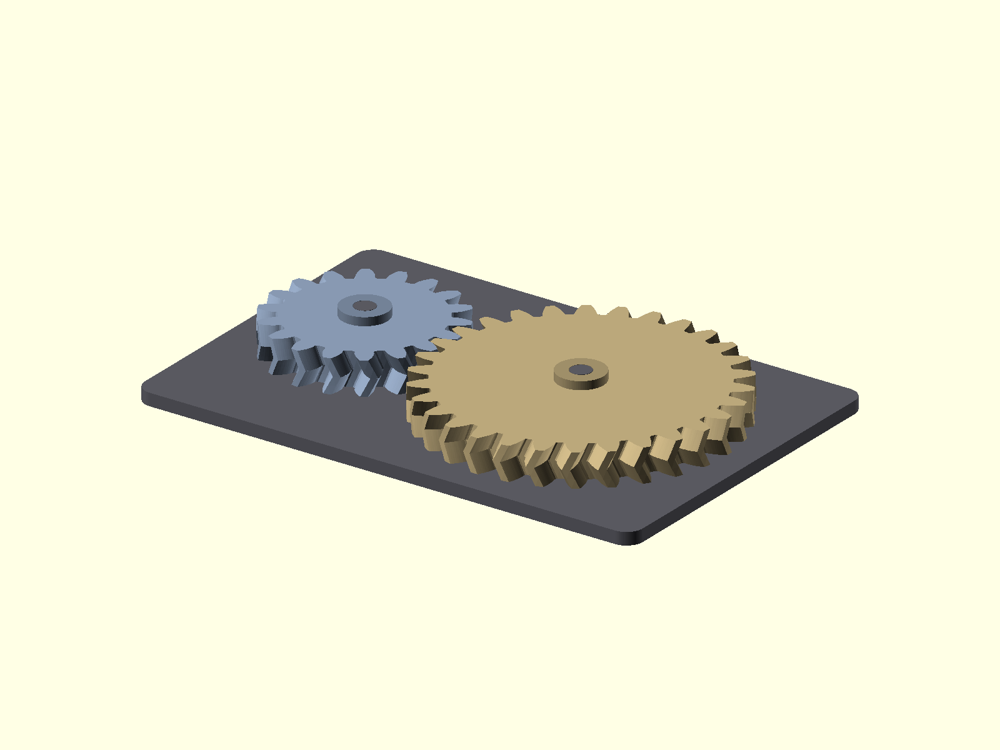

# Parametric OpenSCAD CAD Portfolio

A small portfolio of parametric CAD models written in OpenSCAD. Each project includes
source code, rendered views, and STL exports.

## Projects

| Project | Description | Source | Renders | STL exports |
|---|---|---|---|---|
| **Parametric Serpentine Flow-Field Plate** | Generic electrochemical hardware concept model with adjustable channel width, land width, pass count, port diameter, seal margin, bolt pattern, and plate thickness | [flow_field.scad](03-flow-field-plate/flow_field.scad) | [main](03-flow-field-plate/render.png) · [top](03-flow-field-plate/render_top.png) · [section](03-flow-field-plate/render_section.png) · [detail](03-flow-field-plate/render_detail.png) | [flow_field_plate.stl](03-flow-field-plate/flow_field_plate.stl) |
| **Snap-Fit PCB Enclosure** | Two-part printable enclosure with standoffs, screw pilot holes, cable cutout, lid lip, snap details, and vent slots | [enclosure.scad](01-enclosure/enclosure.scad) | [main](01-enclosure/render.png) · [top](01-enclosure/render_top.png) · [side](01-enclosure/render_side.png) · [detail](01-enclosure/render_detail.png) | [base](01-enclosure/enclosure_base.stl) · [lid](01-enclosure/enclosure_lid.stl) |
| **Herringbone Gear Pair** | Parametric herringbone gear display assembly using BOSL2, with computed gear spacing, visible bores, hubs, baseplate, and separate gear exports | [gears.scad](02-herringbone-gears/gears.scad) | [main](02-herringbone-gears/render.png) · [top](02-herringbone-gears/render_top.png) · [side](02-herringbone-gears/render_side.png) · [detail](02-herringbone-gears/render_detail.png) | [gearA.stl](02-herringbone-gears/gearA.stl) · [gearB.stl](02-herringbone-gears/gearB.stl) |

## Preview

## Opening the Models

Install [OpenSCAD](https://openscad.org/). For the gear project, install
[BOSL2](https://github.com/BelfrySCAD/BOSL2) in the OpenSCAD libraries folder.

Open a project `.scad` file in OpenSCAD:

- **F5** to preview
- **F6** to render
- **Window → Customizer** to adjust parameters
- **File → Export → STL**

## Notes

- All dimensions are in millimeters.
- The flow-field plate is a generic concept model, not a proprietary production design.
- The models are intended as parametric CAD examples and should be reviewed before
  manufacturing.

## License

MIT License.
